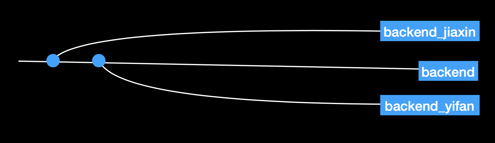

# SeatMe Backend

## Git Branching

"backend" branch is branch out from "develop". Each backend developer has their own branch that branch out from the "backend" branch. After clearlly review, 

### Tools

use homebrew to install: postgresql

useful tools: datagrip, postman (testing)

### data model 

RestaurantAccount: 

| Id   | username | password |
| ---- | :------: | -------: |
| 1    |   ABC    |       xx |
| 2    |   XYZ    |       xx |

Restaurant:

| Id   | restaurant_name |              address |  phone | cuisine_type |
| ---- | :-------------: | -------------------: | -----: | -----------: |
| 1    |    ABC cafe     | 700 commonwealth ave | 123456 |      Mexican |
| 2    |    XYZ cafe     | 701 commonwealth ave | 123456 |      Chinese |

## Reservation:

Table:

| Id   | min_table_size | max_table_size | restaurant_id | current_availability |
| ---- | -------------: | -------------: | ------------: | -------------------- |
| 1    |              2 |              4 |             1 | true                 |
| 2    |              2 |              4 |             2 | false                |
| 3    |              4 |              6 |             1 | true                 |
| 4    |              2 |              4 |             1 | true                 |
| 5    |              6 |              8 |             2 | false                |

Reservation:

| Id   | firstname | lastname |  phone | party_size | restaurant_id | table_id | date | time |
| ---- | :-------: | -------: | -----: | ---------: | ------------: | -------: | ---: | ---: |
| 1    |  jiaxin   |   jiaxin | 123456 |          2 |             1 |        1 | 2/14 |  6-7 |
| 2    |   yifan   |     chen | 123456 |          2 |             1 |        4 | 2/16 |  7-8 |
| 3    |  jiaxin   |      sun | 123456 |          2 |             2 |        2 | 3/10 |  8-9 |

## Waitlist Queue

## CRUD:

